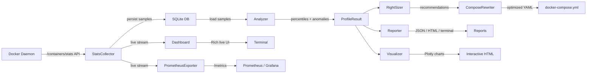
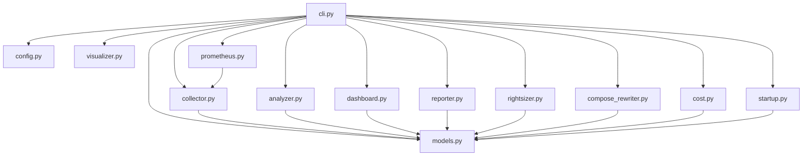

<p align="center">
  
</p>

<h1 align="center">DockPulse</h1>

<p align="center">
  <strong>Your Docker containers are wasting resources. DockPulse tells you exactly how much.</strong>
</p>

<p align="center">
  <a href="https://github.com/hariharanragothaman/dockpulse/actions/workflows/ci.yml"></a>
  <a href="https://github.com/hariharanragothaman/dockpulse/blob/main/LICENSE"></a>
  
</p>

<p align="center">
  <a href="https://github.com/hariharanragothaman/dockpulse/stargazers"></a>
  <a href="https://github.com/hariharanragothaman/dockpulse/network/members"></a>
  <a href="https://github.com/hariharanragothaman/dockpulse/issues"></a>
  <a href="https://github.com/hariharanragothaman/dockpulse/pulls"></a>
</p>

<p align="center">
  <a href="https://hub.docker.com/r/hariharanragothaman/dockpulse"></a>
  <a href="https://hub.docker.com/r/hariharanragothaman/dockpulse"></a>
</p>

<p align="center">
  <a href="https://pypi.org/project/dockpulse/"></a>
  <a href="https://pypi.org/project/dockpulse/"></a>
</p>

<p align="center">
  
  
  
  
  
  
  
</p>

---

## The Problem

Most Docker containers run with either **no resource limits** (risking OOM kills and noisy neighbors) or **wildly over-provisioned limits** set by guesswork. Kubernetes has Vertical Pod Autoscaler for right-sizing, but **standalone Docker has nothing**.

DockPulse fills this gap. It profiles your containers over time, computes percentile-based resource usage, identifies waste, and **automatically rewrites your `docker-compose.yml` with data-driven resource limits**.

## Features

- **Container Profiling** -- Collect CPU, memory, network, and block I/O statistics from running containers over configurable time windows (minutes to days)
- **Percentile Analysis** -- Compute p50 / p95 / p99 resource usage with anomaly detection for memory pressure, CPU spikes, and chronic over-provisioning
- **Right-Sizing Engine** -- Generate recommended `deploy.resources.limits` and `reservations` based on observed p95 usage plus configurable headroom
- **Compose Rewriter** -- Automatically patch `docker-compose.yml` files with optimized limits while preserving comments and formatting (via `ruamel.yaml`)
- **Waste Reports** -- Quantify total memory and CPU waste across your entire stack with actionable savings numbers
- **Live Dashboard** -- Real-time Rich terminal UI with CPU sparklines, memory bars, and color-coded health indicators
- **SQLite Persistence** -- All profiling data is stored locally with zero external dependencies
- **Multiple Output Formats** -- Terminal (Rich), JSON, and styled HTML reports
- **Cloud Cost Estimation** -- Map resource waste to real dollar amounts for AWS Fargate, GCP Cloud Run, and Azure ACI with per-container savings breakdown
- **Grafana Dashboard** -- Pre-built Grafana dashboard with 5 rows of panels covering CPU, memory, network, disk I/O, and PIDs across all monitored containers
- **Startup Time Profiling** -- Measure container startup times (create → running → healthy) with multi-run averaging and compose-file support

## Quick Start

### Installation

```bash
pip install dockpulse
```

Or install from source:

```bash
git clone https://github.com/hariharanragothaman/dockpulse.git
cd dockpulse
pip install -e ".[dev]"
```

Or run via Docker:

```bash
docker run --rm -v /var/run/docker.sock:/var/run/docker.sock \
  hariharanragothaman/dockpulse profile --duration 1h
```

### Basic Usage

```bash
# Profile all running containers for 30 minutes
dockpulse profile --duration 30m

# Profile specific containers for 2 hours at 5-second intervals
dockpulse profile --duration 2h --containers web,db,redis --interval 5

# Analyze collected data
dockpulse analyze

# Right-size a compose file with 25% headroom
dockpulse right-size docker-compose.yml --headroom 25 -o docker-compose.optimized.yml

# View live dashboard
dockpulse dashboard

# Generate a waste report
dockpulse waste
```

## CLI Reference

### `dockpulse profile`

Profile running containers and record resource usage to a local SQLite database.

| Option | Default | Description |
|---|---|---|
| `--duration`, `-d` | `1h` | Profiling duration (e.g. `30m`, `1h`, `2h30m`, `1d`) |
| `--containers`, `-c` | all | Comma-separated container IDs or names |
| `--interval`, `-i` | `1.0` | Seconds between stat samples |

```
$ dockpulse profile --duration 30m
Profiling 3 containers for 30m (interval=1.0s)
  web      | collected 1800 samples
  db       | collected 1800 samples
  redis    | collected 1800 samples
Done. 5400 samples saved to ~/.dockpulse/profiles.db
```

### `dockpulse analyze`

Analyze the most recent profile and display results.

| Option | Default | Description |
|---|---|---|
| `--format`, `-f` | `rich` | Output format: `rich`, `json`, or `html` |
| `--output`, `-o` | -- | Output file path (required for `json`/`html`) |

```
$ dockpulse analyze
Container: web
  CPU   p50=12.3%  p95=34.1%  p99=52.8%   peak=67.2%
  MEM   p50=180MB  p95=245MB  p99=312MB   limit=1024MB
  Anomalies: Over-provisioned (p95 memory is 24% of limit)

Container: db
  CPU   p50=4.1%   p95=18.6%  p99=29.4%   peak=41.0%
  MEM   p50=420MB  p95=510MB  p99=580MB   limit=2048MB
  Anomalies: Over-provisioned (p95 memory is 25% of limit)

Container: redis
  CPU   p50=0.8%   p95=2.1%   p99=3.4%    peak=5.1%
  MEM   p50=28MB   p95=35MB   p99=42MB    limit=512MB
  Anomalies: Over-provisioned (p95 memory is 7% of limit)
```

### `dockpulse right-size`

Right-size a Docker Compose file based on profiled resource usage.

| Argument / Option | Default | Description |
|---|---|---|
| `COMPOSE_FILE` | required | Path to the Docker Compose file |
| `--headroom`, `-H` | `20` | Headroom percentage above p95 |
| `--output`, `-o` | auto | Output path for optimized file |

```
$ dockpulse right-size docker-compose.yml --headroom 25
--- docker-compose.yml
+++ docker-compose.optimized.yml
@@ services.web.deploy.resources @@
+    limits:
+      memory: 306M
+      cpus: '0.43'
+    reservations:
+      memory: 180M

@@ services.db.deploy.resources @@
-    limits:
-      memory: 2048M
+    limits:
+      memory: 638M
+      cpus: '0.24'
+    reservations:
+      memory: 420M

Savings: 1.44 GB memory, 1.83 CPU cores freed
Written to docker-compose.optimized.yml
```

### `dockpulse dashboard`

Launch a live terminal dashboard with real-time resource monitoring.

```
$ dockpulse dashboard
+----------------------------------------------------------------+
|  DockPulse - Container Resource Monitor          Ctrl+C to exit |
|                                                                 |
|  Container  CPU (sparkline)  Avg CPU  Memory         Status     |
|  web        ▂▃▅▃▂▁▂▃▆▄     12.3%    ██████░░ 45.2%  HEALTHY   |
|  db         ▁▁▂▁▁▁▁▂▃▂      4.1%    ████░░░░ 31.0%  HEALTHY   |
|  redis      ▁▁▁▁▁▁▁▁▁▁      0.8%    █░░░░░░░  8.2%  HEALTHY   |
|  worker     ▃▅▇▅▃▅▇█▇▅     78.4%    ███████░ 88.1%  WARNING   |
+----------------------------------------------------------------+
```

### `dockpulse waste`

Show a waste report for the most recent profiling session.

```
$ dockpulse waste
DockPulse Waste Report
======================
Container   Allocated  Used(p95)  Wasted     Utilization
web         1024 MB    245 MB     779 MB     24%
db          2048 MB    510 MB     1538 MB    25%
redis       512 MB     35 MB      477 MB     7%
-------------------------------------------------------
Total       3584 MB    790 MB     2794 MB    22%

You are wasting 2.73 GB of memory and 2.1 CPU cores across 3 containers.
Right-size with: dockpulse right-size docker-compose.yml
```

### `dockpulse cost`

Estimate cloud infrastructure costs and potential savings.

| Option | Default | Description |
|---|---|---|
| `--provider`, `-p` | `aws` | Cloud provider: `aws`, `gcp`, `azure` |
| `--hours` | `730` | Monthly running hours |
| `--headroom`, `-H` | `20` | Headroom percentage for right-sizing |
| `--format`, `-f` | `rich` | Output format: `rich`, `json` |

```
$ dockpulse cost --provider aws
Cloud Cost Estimate (aws_fargate)
Container   Current $/mo   Optimized $/mo   Savings $/mo
web         $32.14         $18.72           $13.42
db          $48.90         $27.55           $21.35
redis       $8.21          $2.10            $6.11
─────────────────────────────────────────────────────────
TOTAL       $89.25         $48.37           $40.88

Based on 730 hours/month at aws_fargate pricing.
```

### `dockpulse startup`

Profile container startup times.

| Argument / Option | Default | Description |
|---|---|---|
| `IMAGE` | -- | Docker image to profile |
| `--compose`, `-C` | -- | Path to docker-compose.yml |
| `--runs`, `-n` | `3` | Number of runs to average |
| `--format`, `-f` | `rich` | Output format: `rich`, `json` |

```
$ dockpulse startup nginx:latest --runs 5
Startup Time Profile
Container   Image          Create→Running   Running→Healthy   Total      Image Size   Healthcheck
nginx       nginx:latest   142ms            —                 142ms      187.8 MB     ✗
```

### Grafana Dashboards

DockPulse ships with three pre-built Grafana dashboards and Prometheus recording/alerting rules. To use them with the bundled Prometheus setup:

```bash
cd examples/prometheus
docker compose up -d
dockpulse export --port 9090   # start the Prometheus exporter

# Open Grafana at http://localhost:3000 (admin/admin)
# All three dashboards are auto-provisioned
```

To point Prometheus at a custom exporter address, set the environment variable before starting:

```bash
DOCKPULSE_EXPORTER_TARGET=my-host:9090 docker compose up -d
```

**Container Resource Overview** (`dockpulse-overview`)
- **Overview row** -- stat panels for total containers, avg CPU%, avg memory%, total network I/O
- **CPU row** -- time series of CPU usage per container with threshold lines
- **Memory row** -- time series of memory usage vs limits, plus memory utilization gauges
- **Network & Disk I/O row** -- time series of RX/TX bytes and block read/write
- **Processes row** -- time series of PID counts per container

**Alerts & Thresholds** (`dockpulse-alerts`)
- **Active alerts list** -- shows currently firing DockPulse alerts
- **CPU/Memory warning counters** -- stat panels showing how many containers exceed thresholds
- **CPU & Memory with threshold overlays** -- time series with 80%/95% warning/critical lines
- **5-minute rolling aggregates** -- CPU p95 and memory averages from Prometheus recording rules

**Right-Sizing & Waste Analysis** (`dockpulse-rightsizing`)
- **Fleet utilization gauge** -- overall memory utilization across all containers
- **Waste metrics** -- estimated memory waste in bytes and as a percentage
- **Per-container bar gauges** -- memory and CPU utilization with waste-detection coloring
- **Waste over time** -- stacked time series showing the gap between limits and actual usage
- **Usage vs Limits** -- side-by-side comparison of actual usage against configured limits

All dashboards support the `$container` template variable for filtering and link to each other for easy navigation.

### Prometheus Recording & Alerting Rules

The bundled `recording_rules.yml` provides pre-computed aggregates and alert definitions:

**Recording rules** -- 5-minute rolling CPU/memory averages and p95s, fleet-wide utilization ratios, per-container network and disk I/O totals.

**Alerting rules:**
| Alert | Condition | Severity |
|-------|-----------|----------|
| `DockPulseHighCPU` | CPU > 80% for 5m | warning |
| `DockPulseCriticalCPU` | CPU > 95% for 2m | critical |
| `DockPulseHighMemory` | Memory > 85% for 5m | warning |
| `DockPulseCriticalMemory` | Memory > 95% for 2m | critical |
| `DockPulseMemoryWaste` | <20% memory used for 30m | info |
| `DockPulseHighPIDs` | PIDs > 500 for 5m | warning |
| `DockPulseContainerDown` | Exporter unreachable for 1m | critical |

## Architecture

### Data Flow



### Module Dependency Graph



### CLI Command Map

```mermaid
flowchart TD
    CLI["dockpulse"]
    Profile["profile"]
    Analyze["analyze"]
    RightSize["right-size"]
    Dash["dashboard"]
    Waste["waste"]
    Report["report"]
    Sessions["sessions"]
    Compare["compare"]
    Stack["stack"]
    Clean["clean"]
    Export["export"]
    Cost["cost"]
    Startup["startup"]

    CLI --> Profile
    CLI --> Analyze
    CLI --> RightSize
    CLI --> Dash
    CLI --> Waste
    CLI --> Report
    CLI --> Sessions
    CLI --> Compare
    CLI --> Stack
    CLI --> Clean
    CLI --> Export
    CLI --> Cost
    CLI --> Startup

    Profile ---|"collect stats over time"| SQLite["SQLite DB"]
    Analyze ---|"percentile analysis"| TermOut["Terminal / JSON / HTML"]
    RightSize ---|"optimize limits"| ComposeOut["Compose YAML"]
    Dash ---|"live monitoring"| LiveUI["Rich Live UI"]
    Waste ---|"quantify waste"| WasteOut["Waste Report"]
    Report ---|"interactive charts"| PlotlyOut["Plotly HTML"]
    Sessions ---|"list sessions"| SessionTable["Session Table"]
    Compare ---|"diff two sessions"| DeltaTable["Delta Table"]
    Stack ---|"multi-container analysis"| StackOut["Rankings + Bottleneck"]
    Clean ---|"delete data"| CleanDB["SQLite Cleanup"]
    Export ---|"Prometheus metrics"| MetricsOut["/metrics endpoint"]
    Cost ---|"cloud pricing"| CostOut["Cost Report"]
    Startup ---|"timing analysis"| StartupOut["Startup Profile"]
```



DockPulse talks directly to the Docker daemon via the Docker SDK for Python. Stats are collected using the `/containers/{id}/stats` API endpoint and persisted to a local SQLite database for offline analysis.

The right-sizing engine applies a configurable headroom percentage on top of observed p95 usage. The compose rewriter uses `ruamel.yaml` to update files in-place without destroying comments or formatting.

## Comparison

| Feature | DockPulse | `docker stats` | Kubernetes VPA |
|---|:---:|:---:|:---:|
| Time-series profiling | Yes | No (snapshot only) | Yes |
| Percentile analysis | p50/p95/p99 | No | Yes |
| Anomaly detection | Yes | No | No |
| Compose file rewriting | Yes | No | N/A (k8s only) |
| Waste quantification | Yes | No | No |
| Live dashboard | Yes | Basic | No |
| Works without Kubernetes | Yes | Yes | No |
| Zero external dependencies | Yes | Yes | No (requires k8s) |

## Roadmap

- [x] Prometheus metrics export
- [x] Historical trend analysis and regression detection
- [x] GitHub Action for CI resource regression checks
- [x] Interactive Plotly HTML reports
- [x] Session management and comparison
- [x] Multi-container stack analysis
- [ ] Slack / Discord alert integration
- [x] Cost estimation (map waste to cloud provider pricing)
- [x] Grafana dashboard templates
- [x] Grafana alerting rules and right-sizing dashboards
- [x] Prometheus recording rules and configurable scrape targets
- [x] Container startup time profiling
- [x] PyPI package publishing with auto-versioning

## Contributing

Contributions are welcome! See [CONTRIBUTING.md](CONTRIBUTING.md) for development setup, workflow, and guidelines.

```bash
# Development setup
git clone https://github.com/hariharanragothaman/dockpulse.git
cd dockpulse
pip install -e ".[dev]"

# Run tests
pytest

# Run linter
ruff check src/ tests/

# Run type checker
mypy src/
```

## License

MIT License. See [LICENSE](LICENSE) for details.

---

<p align="center">
  Built with the <a href="https://docs.docker.com/engine/api/sdk/">Docker SDK for Python</a>,
  <a href="https://typer.tiangolo.com/">Typer</a>, and
  <a href="https://rich.readthedocs.io/">Rich</a>.
</p>

<p align="center">
  <a href="https://github.com/hariharanragothaman/dockpulse">
    
  </a>
</p>
